

  

  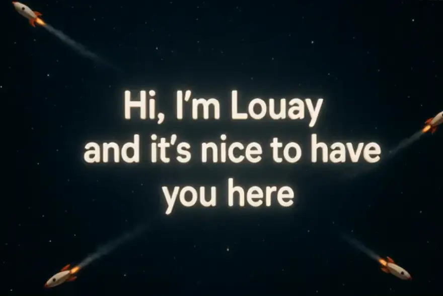

<picture>
  <source media="(prefers-color-scheme: dark)" srcset="assets/section-about-dark.svg"/>
  
</picture>

Hi there! I'm Louay Kashkool, a Full-Stack Software Engineer based in Doha, Qatar. I build and run production web applications end to end: architecture, backend, frontend, AWS infrastructure, CI/CD and security.

Some of my core achievements:

- Built and run [jadwal.qa](https://jadwal.qa), a GCC event-booking marketplace live in 6 countries, as its founding engineer
- Own its AWS production setup (ECS Fargate, RDS, CloudFront) with zero-downtime deploys and automatic rollback
- Hardened CI/CD with OIDC-based AWS deploys and Semgrep, CodeQL, Gitleaks and Trivy scans on every merge, backed by 2,300+ automated tests
- Root-caused and fixed a broken signature check in a payment provider's callback that was silently failing every transaction

You can reach me via email, LinkedIn, or check out my portfolio and projects to learn more about my work.

 

<picture>
  <source media="(prefers-color-scheme: dark)" srcset="assets/section-projects-dark.svg"/>
  
</picture>

<a href="https://jadwal.qa">
  
</a>

  
  <a href="https://github.com/jadwalit-jpg/Jadwal"></a>

 

<a href="https://louaykashkool-portfolio.vercel.app/">
  
</a>

  

 

<a href="https://nizarjewellery.com/">
  
</a>

  

 

<picture>
  <source media="(prefers-color-scheme: dark)" srcset="assets/section-skills-dark.svg"/>
  
</picture>

<picture>
  <source media="(prefers-color-scheme: dark)" srcset="https://skillicons.dev/icons?i=ts%2Cjs%2Cpython%2Cnodejs%2Cnestjs%2Cnextjs%2Creact%2Cpostgres%2Cprisma%2Credis%2Cmongodb%2Caws%2Cdocker%2Cgithubactions%2Ccloudflare%2Cgit&theme=dark&perline=8"/>
  
</picture>

**Also comfortable with**: SQL (Postgres), CI/CD pipelines, Networking & Security, Basic ML workflows.

 

<picture>
  <source media="(prefers-color-scheme: dark)" srcset="assets/section-stats-dark.svg"/>
  
</picture>

 

<picture>
  <source media="(prefers-color-scheme: dark)" srcset="assets/section-links-dark.svg"/>
  
</picture>

  <a href="https://louaykashkool-portfolio.vercel.app/"></a>
  <a href="https://jadwal.qa"></a>
  <a href="https://nizarjewellery.com/"></a>
  <a href="mailto:Loaekashkoool@gmail.com"></a>
  <a href="https://www.linkedin.com/in/louay-kashkool-52a45b313/"></a>
  <a href="https://www.instagram.com/l.k_2910/"></a>

