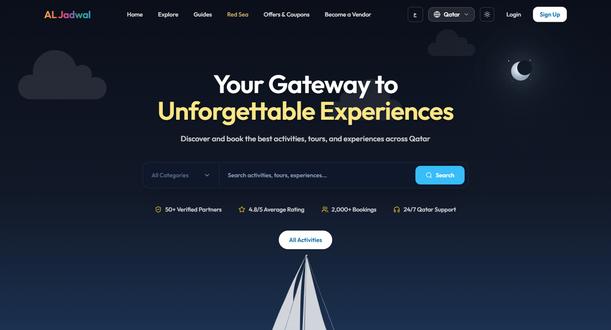
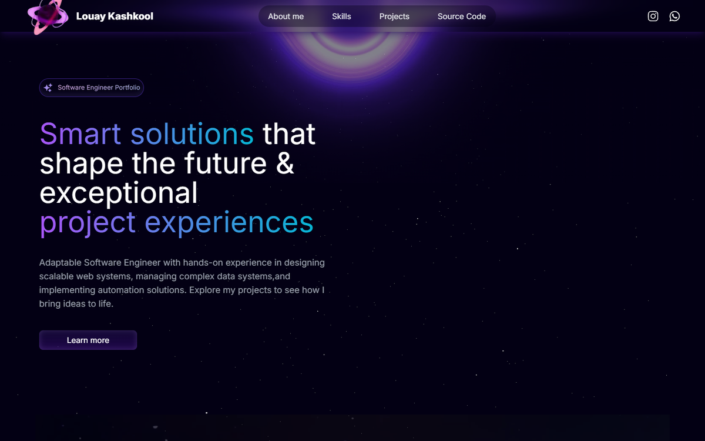

# 🚀 Louay Kashkool  
**`Full-Stack Software Engineer | DevOps & Cloud Security`**  

  

---

## About Me  
Hi there! I'm Louay Kashkool, a Full-Stack Software Engineer based in Doha, Qatar. I build and run production web applications end to end: architecture, backend, frontend, AWS infrastructure, CI/CD and security.  

Some of my core achievements:  
- Built and run [jadwal.qa](https://jadwal.qa), a GCC event-booking marketplace live in 6 countries, as its founding engineer  
- Own its AWS production setup (ECS Fargate, RDS, CloudFront) with zero-downtime deploys and automatic rollback  
- Hardened CI/CD with OIDC-based AWS deploys and Semgrep, CodeQL, Gitleaks and Trivy scans on every merge, backed by 2,300+ automated tests  
- Root-caused and fixed a broken signature check in a payment provider's callback that was silently failing every transaction  

You can reach me via email, LinkedIn, or check out my portfolio and projects to learn more about my work.

---

## Skill Stack  
  

**Also comfortable with**: SQL (Postgres), CI/CD pipelines, Networking & Security, Basic ML workflows.  

---

## Projects – Showcase  

<table>
  <tr>
    <td align="center" colspan="2">
      
       
      <b>Jadwal — GCC Event-Booking Marketplace</b> 
      Live in Qatar, KSA, UAE, Bahrain, Oman and Kuwait. NestJS · Next.js · PostgreSQL · AWS ECS Fargate · 2,300+ tests. 
      🔗 <a href="https://jadwal.qa">Live Site</a> · <a href="https://github.com/jadwalit-jpg/Jadwal">Source</a>
    </td>
  </tr>
  <tr>
    <td align="center" width="50%">
      
       
      <b>Portfolio Website</b> 
      My personal portfolio showcasing projects and experience. 
      🔗 <a href="https://louaykashkool-portfolio.vercel.app/">Live Site</a>
    </td>
    <td align="center" width="50%">
      
       
      <b>Gold Store Web App</b> 
      A modern store platform for managing and browsing gold products. 
      🔗 <a href="https://nizarjewellery.com/">Live App</a>
    </td>
  </tr>
</table>

---

## Stats  
  

---

## Links  
- [**Portfolio**](https://louaykashkool-portfolio.vercel.app/)  
- [**Gold Store App**](https://nizarjewellery.com/)  
- [**Contact**](mailto:Loaekashkoool@gmail.com)  

